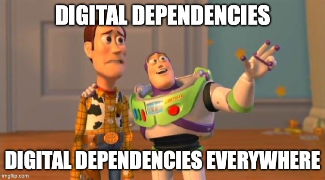

theme: Merriweather,8

# Digitale Souveränität

## Für Europäische Softwareentwickler

### Siegfried GÖSCHL

#### ASCIIFISH GmbH
--- 

## Siegfried GÖSCHL

[.column]

* Java Backend Developer
* Open Source Evangelist
* Mitgründer der **Java User Group Austria** in 2001
* Hilft beim **Java Meetup Vienna** & **DevFest Vienna**

[.column]

---

## Was Ist Digitale Souveränität für Softwareentwickler?!

---

## Unabhängigkeit von teuren proprietären Tools und/oder US-Konzernen durch strategische Technologieentscheidungen

---

---

## Fikitives Developer Onboarding

* Linux und Macs werden nicht unterstützt - ist Company Policy
* Outlook notwendig wegen Exchange Server
* ZUm Arbeiten wird Microsoft Office verwendet
* Technische Dokumente in Confluence und Sharepoint

^ - Fiktives (oder nicht so fiktives) Onboarding eines Software Entwicklers

---

## Fikitives Developer Onboarding

* Bug Tracking in JIRA
* Es gibt etliche Oracle Datenbanken im Haus
* Die Produktion läuft auf AWS

---

---

---

## Und Jetzt?!

--- 

> Wer etwas will, findet Wege. Wer etwas nicht will, findet Gründe.
> -- Götz Werner, Gründer dm Drogerie Markt

---

## Strategien zur Verbesserung der digitalen Souveränität in der Softwareentwicklung

* Priorisierung von Open Source
* Reduktion technologischer Abhängigkeiten
* Interoperabilität & Standards
* Eigene Infrastruktur & Datenkontrolle

---

## Priorisierung Von Open Source

* Einsatz freier Entwicklungsumgebungen & Tools
* Freie Datenbanken (PostgreSQL, MariaDB) statt kommerzieller DBs (Oracle, MSSQL, SAP HANA, mySQL)
* Verwendung von Open Source Frameworks (Spring Boot, Quarkus, Django, Angular, React)

^ Open Source Frameworks erleichtern die Verwendung anderer Open Source Projekte

---

## Reduktion Technologischer Abhängigkeiten

* Minimierung von Vendor Lock-in: offene Standards (z. B. OpenAPI, SQL, OAuth) statt proprietärer Technologien
* Cloud-Strategie prüfen: Multi-Cloud oder Hybrid-Ansätze statt nur AWS, Azure oder GCP
* Einsatz von Container (Docker, Podman) und Orchestrierung (Kubernetes, OpenShift) in der Cloud
* Multi-Cloud oder Hybrid-Ansätze verbesseren Verhandlungsposition

---

## Eigene Infrastruktur & Datenkontrolle

* Nutzung offener Datenformate (JSON, YAML, XML, CSV) statt proprietärer Formate
* Libre Office & NextCloud als Alternative zu Microsoft
* Self-Hosting wichtiger Systeme (z. B. Git, CI/CD, Issue-Tracker) mit Tools wie GitLab CE, Gitea, Jenkins, SonarQube
* Datenhaltung bevorzugt auf eigener Hardware oder in souveränen europäischen Clouds

---

## Programmiersprachen

|        **Sprache**        |                          **Abhängigkeit**                           |                                        **Vorteile für Souveränität**                                         |                            **Nachteile / Verzicht**                             |
|:-------------------------:|:-------------------------------------------------------------------:|:------------------------------------------------------------------------------------------------------------:|:-------------------------------------------------------------------------------:|
|        **Python**         |              Community-getrieben, keine einzelne Firma              |  Enorm große Community, viele freie Tools, Plattformunabhängig, starker Fokus auf Wissenschaft, KI, DevOps   | Teilweise Performance (im Vergleich zu C/Go/Java), viele inkompatible Libraries |
|         **Java**          |          Oracle (Historisch), Eclipse Foundation, OpenJDK           | Sehr viele Open-Source-Implementierungen (OpenJDK, Eclipse Temurin, Azul, Adoptium), große Community, stabil |          Teilweise Oracle-Politik bzgl. Lizenzen, „Enterprise-lastig“           |
|         **C/C++**         |      ISO-Standard, Compiler vielfach Open-Source (GCC, Clang)       |                        Sehr souverän, extrem viele freie Werkzeuge, Industriestandard                        |                      Komplexe Toolchains, steile Lernkurve                      |
|      **Go (Golang)**      |               Google (ursprünglich), aber Open-Source               |             Einfach, modern, hervorragende Performance, sehr gutes Ökosystem, viele freie Tools              |                Google hat starken Einfluss (Governance, Roadmap)                |
|         **Rust**          |              Community & Rust Foundation (unabhängig)               |                 Sehr moderne Sprache, performant, sicher, Open-Source, wachsendes Ökosystem                  |            Noch weniger Enterprise-Tooling, Einarbeitung schwieriger            |
| **JavaScript/TypeScript** | Starker Einfluss von Microsoft (TypeScript) und Google (Node.js/V8) |                  Sehr große Entwicklerbasis, viele freie Frameworks, Browser als Plattform                   |         Abhängigkeit von Google (V8) und Microsoft (TS, GitHub/VS Code)         |
|        **C#/.NET**        |          Trotz .NET Core Öffnung starke Microsoft-Bindung           |                                   Große Entwicklerbasis, freie Frameworks                                    |       Verlust des "First Class Supports" bei Verwendung anderer Sprachen        |

^ Umstieg auf eine andere Programmiersprache oft nicht möglich / sinnvoll
- Kommerzielles Umfeld
- Umstellen von Legacy Code?!
- Umschulen der Mitarbeiter?

---

## Entwicklungsumgebungen

| Entwicklungsumgebung                | Vorteile                                                                                                                                                                   | Nachteile                                                                                                                                                                          |
|-------------------------------------|----------------------------------------------------------------------------------------------------------------------------------------------------------------------------|------------------------------------------------------------------------------------------------------------------------------------------------------------------------------------|
| **Emacs**                           | - Extrem anpassbar & erweiterbar (Lisp) - Vollständig Open Source - Plattformunabhängig - Jahrzehntelang bewährt, riesige Community                               | - Sehr steile Lernkurve - Bedienung ungewohnt - Mit vielen Erweiterungen ressourcenintensiv                                                                                  |
| **Vim / Neovim**                    | - Sehr leichtgewichtig & blitzschnell - Läuft auf fast allen Systemen - Tastaturzentrierte Bedienung - Riesige Community, viele Plugins                           | - Hohe Einstiegshürde für Neulinge - Weniger komfortabel als moderne IDEs - Kaum integrierte Enterprise-Features                                                             |
| **VS Code (Microsoft)**             | - Kostenlos & weit verbreitet - Riesiges Erweiterungs-Ökosystem - Git-Integration & Debugging integriert - Plattformübergreifend - Benutzerfreundlich & modern | - Offizielle Builds enthalten Telemetrie - Gefahr von Vendor Lock-in (Azure/GitHub) - Kein vollständiger IDE-Ersatz - Performance bei sehr großen Projekten eingeschränkt |
| **IntelliJ IDEA Community Edition** | - Kostenlos & Open Source - Sehr benutzerfreundlich - Starke Java- & Kotlin-Unterstützung - Plattformübergreifend - Gute Integration mit Maven/Gradle          | - Eingeschränkter Funktionsumfang (kein Spring, kein Java EE, keine erweiterten Frameworks) - Weniger für Enterprise-Anwendungen geeignet                                       |

---

## Entwicklungsumgebungen

| Entwicklungsumgebung        | Vorteile                                                                                                                                                                                                           | Nachteile                                                                                                                                                                                                                |
|-----------------------------|--------------------------------------------------------------------------------------------------------------------------------------------------------------------------------------------------------------------|--------------------------------------------------------------------------------------------------------------------------------------------------------------------------------------------------------------------------|
| **IntelliJ IDEA Ultimate**  | - Vollständige IDE mit allen Enterprise-Features - Breite Unterstützung für Java, Kotlin, Spring, Java EE, Datenbanken, Webframeworks - Sehr gute Code-Analyse & Refactoring - Plattformübergreifend      | - Proprietär & kostenpflichtig - Ressourcenschwer - Abhängigkeit von JetBrains-Lizenzmodell                                                                                                                        |
| **Eclipse**                 | - Vollständig Open Source - Riesige Community & viele Plugins - Plattformübergreifend - Starke Java-Integration - Keine Lizenzkosten                                                                   | - Oberfläche altmodisch - Performance bei großen Projekten träge - Plugins teils unübersichtlich & qualitativ schwankend                                                                                           |
| **NetBeans (Apache)**       | - Vollständig Open Source - Plattformübergreifend - Gute Java- & PHP-Unterstützung - Maven, Git & CI integriert                                                                                           | - Weniger aktiv entwickelt als Eclipse/IntelliJ - Oberfläche wirkt altbacken - Kleinere Community - Weniger moderne Features                                                                                    |
| **Microsoft Visual Studio** | - Sehr mächtige IDE - Exzellente Debugging- & Profiling-Tools - Optimiert für .NET, C#, Azure, SQL Server - Umfangreiche Enterprise-Features (Architektur, Tests, CI/CD) - Große Community & Ökosystem | - Proprietär, keine Open-Source-Variante - Hohe Lizenzkosten (außer Community Edition) - Sehr ressourcenhungrig - Volle Funktionalität nur unter Windows - Gefahr von Vendor Lock-in mit Microsoft-Ökosystem |

---

## Datenbanken

| Datenbank                        | Typ                     | Vorteile                                                                                                                                                                                                                          | Nachteile                                                                                                                                        |
|----------------------------------|-------------------------|-----------------------------------------------------------------------------------------------------------------------------------------------------------------------------------------------------------------------------------|--------------------------------------------------------------------------------------------------------------------------------------------------|
| **Oracle Database**              | Kommerziell             | - Sehr leistungsfähig & hochskalierbar - Umfassende Enterprise-Features (RAC, Data Guard, Partitionierung) - Hohe Stabilität & Sicherheit - Weltweit verbreitet in Großunternehmen - Umfangreicher Hersteller-Support | - Sehr hohe Lizenz- und Supportkosten - Komplexes Lizenzmodell - Proprietär → starker Vendor Lock-in - Administration komplex           |
| **Microsoft SQL Server (MSSQL)** | Kommerziell             | - Gute Integration in Microsoft-Ökosystem (Windows, Azure, PowerBI) - Leistungsfähige BI- und Reporting-Features - Stabil, weit verbreitet im Enterprise - Gute Tools für Entwickler (SSMS, Profiler)                    | - Proprietär, Vendor Lock-in - Lizenzkosten hoch (Enterprise Edition) - Primär auf Windows/Linux - Abhängigkeit von Microsoft-Strategie |
| **SAP HANA**                     | Kommerziell (In-Memory) | - Sehr hohe Performance durch In-Memory-Architektur - Echtzeit-Analytik & OLAP/OLTP kombiniert - Optimiert für SAP-ERP/BI - Starke Integrationsmöglichkeiten in SAP-Produkte                                             | - Extrem teuer (Lizenzen + Hardware) - Proprietär, Vendor Lock-in mit SAP - Hohe Hardware-Anforderungen - Eher für SAP-Kunden sinnvoll  |

---

## Datenbanken

| Datenbank                     | Typ                                | Vorteile                                                                                                                                                                                                                   | Nachteile                                                                                                                                                                                       |
|-------------------------------|------------------------------------|----------------------------------------------------------------------------------------------------------------------------------------------------------------------------------------------------------------------------|-------------------------------------------------------------------------------------------------------------------------------------------------------------------------------------------------|
| **MySQL (Community Edition)** | Frei (Open Source, gehört Oracle)  | - Weit verbreitet, große Community - Einfach zu installieren & zu administrieren - Gute Performance für Webanwendungen - Viele Hosting-Anbieter unterstützen MySQL nativ - Kostenlos in Community Edition      | - Kommerzielle Versionen mit erweiterten Features proprietär - Weniger standardkonform als PostgreSQL - Eingeschränkte Enterprise-Funktionalitäten - Teilweise Abhängigkeit von Oracle |
| **PostgreSQL**                | Frei (Open Source)                 | - Vollständig Open Source & kostenlos - Sehr leistungsfähig, stabil & erweiterbar - Starke Standardkonformität (SQL, ACID) - Erweiterungen (PostGIS, TimescaleDB, FDWs) - Plattformunabhängig, große Community | - Weniger „Out-of-the-box“-Enterprise-Tools als Oracle - Komplexere Administration im Vergleich zu MySQL/MariaDB - Kein zentraler Hersteller-Support (nur Drittanbieter)                  |
| **MariaDB**                   | Frei (Open Source, Fork von MySQL) | - Komplett Open Source - Kompatibel zu MySQL (Drop-in Replacement) - Flexibel durch viele Storage Engines - Schnell & leichtgewichtig - Plattformübergreifend                                                  | - Kleinere Community als MySQL/Postgres - Weniger Enterprise-Features - Weniger verbreitet im Enterprise-Sektor - Für extreme Skalierung nicht so optimiert wie Oracle/PG              |

---

## Mein Techstack

* MacBook Pro M1 als Arbeitsgerät
* Git für die Versionskontrolle (zusammen mit GitHub)
* Sublime & Visual Code als Editor
* IntelliJ Ultimate als IDE
* Java, Maven & Spring

---

## Mein Techstack

* DbVisualizer für Datenbankankzugriff
* AsciiDoc & PlantUML für Dokumentation
* [Joplien](https://joplinapp.org) & [Bear](https://bear.app) für Notizen
* [Deckset](https://www.deckset.com) für Präsentation
* Docker Client zum Ausführen von Containern

---

---

 
---

## Work In Progress

---
