theme: Merriweather,8


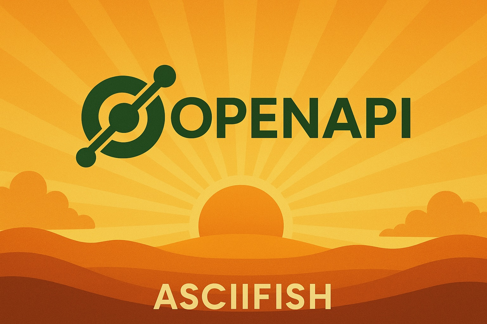

---

# Everything You Always Wanted To Know About OpenAPI
#### Siegfried GOESCHL, ASCIIFISH

--- 


---

## What Is OpenAPI?

> The OpenAPI Specification, previously known as the Swagger Specification, is a specification for machine-readable interface files for describing, producing, consuming, and visualizing RESTful web services
-- Wikipedia

^ - A way to define machine-readable interface files to work with RESTful web services.
- The term SWAGGER stems from the OpenAPI history.

---

## A Brief History Of OpenAPI

| Year  | Event                                                     |
| ------| --------------------------------------------------------- |
| 2010  | Swagger development began in early 2010                   |
| 2015  | SmartBear purchased development                           |
| 2016  | Renamed from Swagger to OpenAPI                           |
| 2017  | OpenAPI 3.0.0 release                                     |
| 2021  | OpenAPI 3.1.0 release                                     |
| 2024  | OpenAPI 3.1.1 release                                     |

---

## Why Bother With OpenAPI?

---

## Obstacles To Consuming APIs[^1]


[^1]: Postman 2022 State Of The API Report

^ Biggest problem: lack of documentation, lack of knowledge and lack of time

---


^ An API is usually meant to be consumed by someone else

---

## Improving API Documentation[^1]


[^1]: Postman 2022 State Of The API Report

^ Modest improvements: up2date documentation, examples, interactive usage

---

## OpenAPI Ticks Most Boxes

* Up-to-date documentation :heavy_check_mark:
* Better examples :heavy_check_mark:
* Standardized documentation :heavy_check_mark:
* Better documentation work flow :heavy_check_mark:
* Try it / interactive documentation :heavy_check_mark:

---


^ I hope I still have your attention.

---

# OpenAPI Overview

---

## Open API First Contact

* OpenAPI files are written in YAML or JSON
  * YAML is easier to read
  * See [YAML Considered Harmful, Philipp Krenn](https://www.google.com/url?sa=t&source=web&rct=j&opi=89978449&url=https://www.youtube.com/watch%3Fv%3DWQurEEfSf8M&ved=2ahUKEwjVyaSOiruJAxVCRvEDHcUUEWcQwqsBegQIDBAF&usg=AOvVaw3kO1tyqXtLWtCqDcU-MGEQ)
  * JSON/YAML conversion in Online Swagger Editor

---

## OpenAPI 3.X Basic Structure

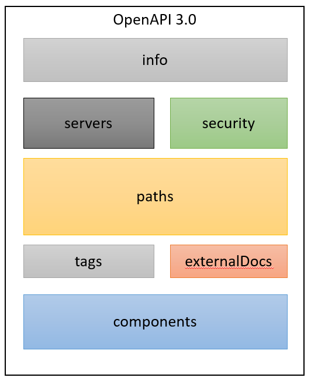

--- 

## Info Section

```yaml
info:
  title: Swagger Petstore - OpenAPI 3.0
  description: >-
    This is a sample Pet Store Server based on the OpenAPI 3.0 specification. 
    You can find out more about ...
  termsOfService: 'http://swagger.io/terms/'
  contact:
    email: apiteam@swagger.io
  license:
    name: Apache 2.0
    url: 'http://www.apache.org/licenses/LICENSE-2.0.html'
  version: 1.0.17
```

---

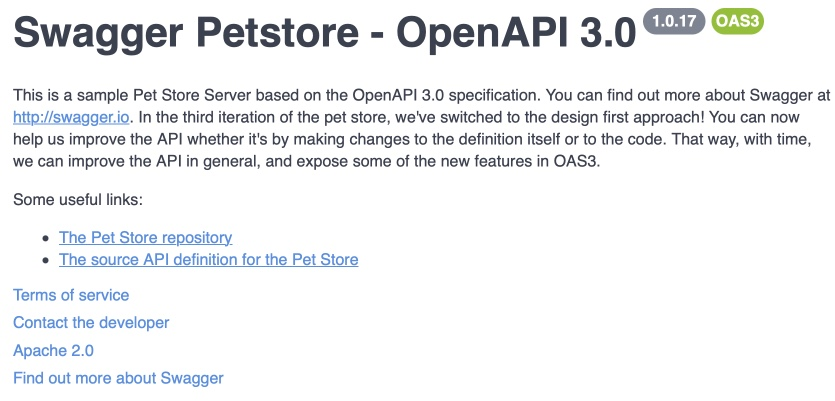

--- 

## Servers Section

```yaml
servers:
  - url: http://localhost:8080
  - url: http://petstore.swagger.io/v1
```

---

## Security Section

```yaml
components:
  securitySchemes:
    petstore_auth:
      type: oauth2
      flows:
        implicit:
          authorizationUrl: 'https://petstore3.swagger.io/oauth/authorize'
          scopes:
            'write:pets': modify pets in your account
            'read:pets': read your pets
    api_key:
      type: apiKey
      name: api_key
      in: header
      security:
        - petstore_auth:
            - 'write:pets'
            - 'read:pets'      

```

^ Supports API Keys, HTTP Authentication, OAuth 2.0, OpenID Connect

---

## Security Section

```yaml
paths:
  /pet:
    put:
      tags:
        - pet
      summary: Update an existing pet
      description: Update an existing pet by Id
      operationId: updatePet
      requestBody:
      responses:
      security:
        - petstore_auth:
            - 'write:pets'
            - 'read:pets'
```

^ Update a resource requiring custom claims

---


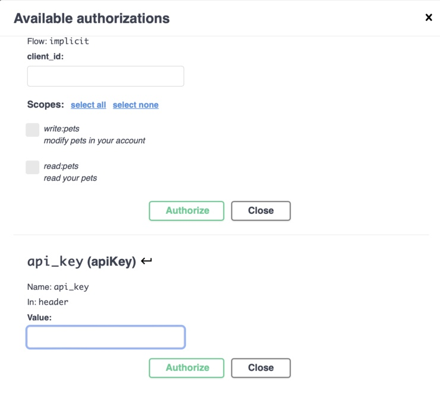

--- 

## Paths Section

```yaml
paths:
  /pet:
    put:
      tags:
        - pet
      summary: Update an existing pet
      description: Update an existing pet by Id
      operationId: updatePet
      requestBody:
        description: Update an existent pet in the store
        content:
          application/json:
            schema:
              $ref: '#/components/schemas/Pet'
        required: true
```

^ The "operationId" is used for generated method name
Tag + operatorId => Interface / method

---

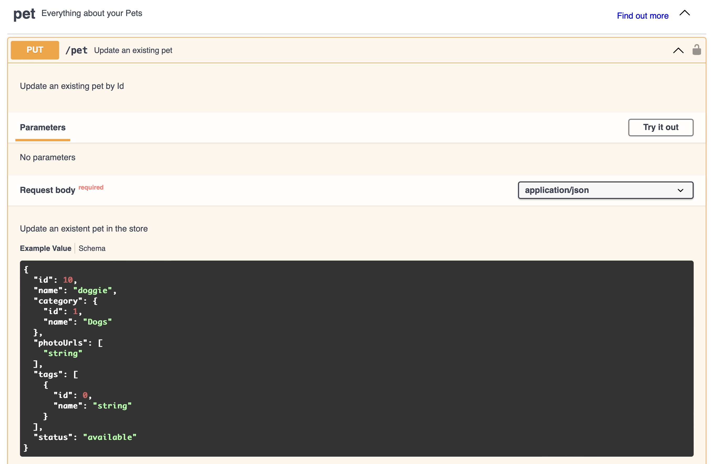

--- 

## Tags Section

```yaml
tags:
  - name: pet
    description: Everything about your Pets
    externalDocs:
      description: Find out more
      url: 'http://swagger.io'
  - name: store
    description: Access to Petstore orders
    externalDocs:
      description: Find out more about our store
      url: 'http://swagger.io'
  - name: user
    description: Operations about user
```

^ Used for grouping in the Swagger UI

---

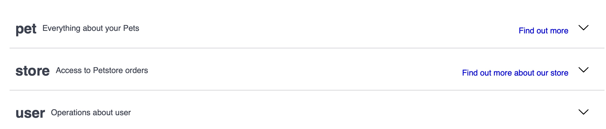

^ Tag names are used generated Java interfaces

---

## Components Section

```yaml
components:
  schemas:
    Category:
      type: object
      properties:
        id:
          type: integer
          format: int64
          example: 1
        name:
          type: string
          example: Dogs
```

^ The data structures of your OpenAPI spec

---

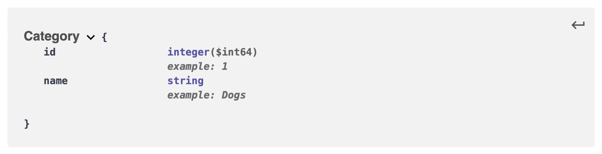

---

# Design Or Code First?!

---


^ Write code to generate OpenAPI or generate code from OpenAPI.

---

[.column]

## Code First

* Write controllers with tons of annotations
* Server-side framework creates OpenAPI on the fly
* OpenAPI spec always up2date

[.column]

## Design First

* Write OpenAPI spec from scratch
* Implementation follows the OpenAPI spec
* You may or may not create OpenAPI on the fly

---

## Design First - The Good

* Improved documentation quality
  * Focus on writing a consistent spec
  * No need to write obfuscated controller code
* Early review of REST API design/changes
  * Use OpenAPI to define/refine the domain model?!

^ Controller code is ugly, more annotations than source code.
willhaben uses OpenAPI to describe the domain model.

---

## Design First - The Bad

* Learning curve for developers
  * Writing the first OpenAPI spec is hard
  * Having good templates helps
* Design & manual code can be out of sync
  * Code generation is (more or less) mandatory

^ You shall not start with an empty spec.

---

## How To Write An OpenAPI File?!

---

## Design First Tooling

* IntelliJ 
* Visual Studio Code with OpenAPI extension
* Online Swagger Editor
* Vim with OpenAPI plugin (for the real nerds)

---

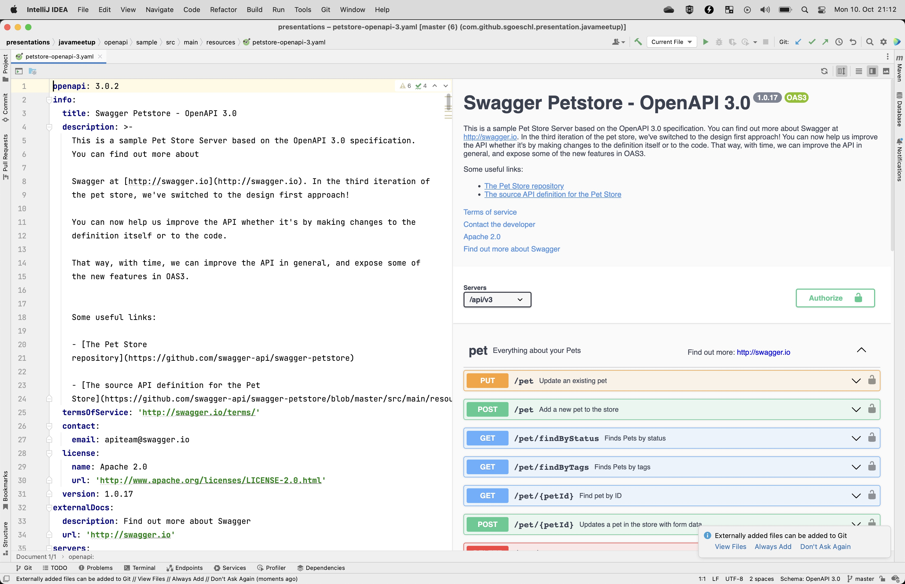

^ Context-sensitive navigation.
Manual reload of changes is required.

---

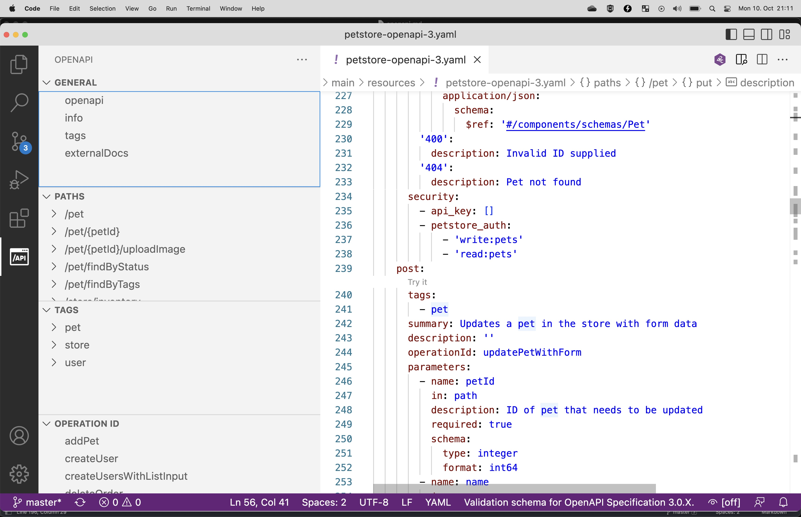

^ OpenAPI plugin available.
Different view than IntelliJ.

---


^ JS application running in your browser.
Best OpenAPI validation.

---

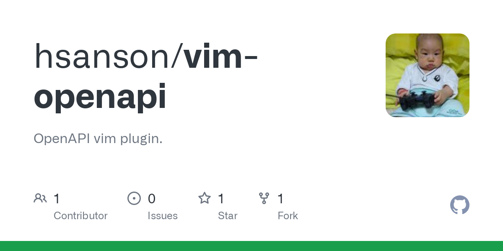

^ For the real developers among us.

---

#  Source Code Generation

---

#  Source Code Generation

* Swagger Editor (sort of tech demo)
* Gradle Plugin
* Maven Plugin

^ I'm focusing on JVM server-side code.

---

## Server & Client Generators

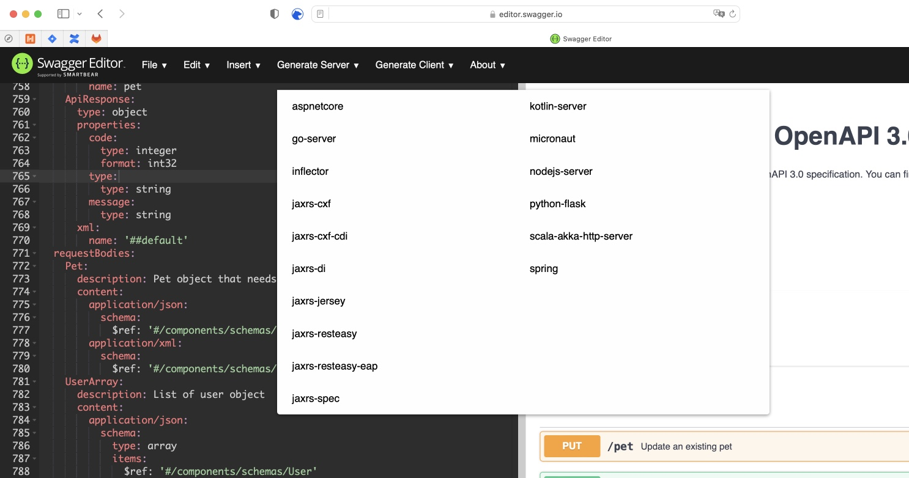

^ No way to tweak the code generation

---  

## openapi-generator-maven-plugin

* There are many different Java source code generators
  * Spring Boot 2 & 3, Micronaut, JAX-RS, ...
* Plus interesting client options
  * Javascript, Typescript, Swift, ...
* Review the generated source code
  * Generators are of varying quality!!
* Put generated code under version control?

^ Swiss army knife for source code generation.

---

## openapi-generator-maven-plugin

```xml
<configuration>
    <inputSpec>
        ${project.basedir}/src/main/resources/petstore-openapi-3.yaml
    </inputSpec>
    <generatorName>spring</generatorName>
    <apiPackage>com.github.sgoeschl.openapi.demo.api</apiPackage>
    <modelPackage>com.github.sgoeschl.openapi.demo.model</modelPackage>
    <supportingFilesToGenerate>ApiUtil.java</supportingFilesToGenerate>
    <configOptions>
        <delegatePattern>true</delegatePattern>
        <hideGenerationTimestamp>true</hideGenerationTimestamp>
        <openApiNullable>false</openApiNullable>
        <useTags>true</useTags>
    </configOptions>
</configuration>
```

---

## OpenAPI Spring Boot Generator

* Spring Boot 2 & 3 support
* `delegatePattern` separates generated & written code
* Skipping `openApiNullable` and additional Jackson library
* `useTags` is nice since it generates an interface per tag
* `hideGenerationTimestamp` to keep you and Git happy

^ Generated server code can be used in production
Generated code may be formatted and put under version control.

---

### Generated APIs

```
src/main/java/com/github/sgoeschl/openapi/demo/rest/api

|-- ApiUtil.java
|-- PetApi.java
|-- PetApiController.java
|-- PetApiDelegate.java
|-- StoreApi.java
|-- StoreApiController.java
|-- StoreApiDelegate.java
```

^ Tag names are used for the API class name, e.g. "PetApi"
"operatorId" for method names within the API

---

### Generated Model Classes

```
src/main/java/com/github/sgoeschl/openapi/demo/rest/model

|-- Address.java
|-- Category.java
|-- Customer.java
|-- ModelApiResponse.java
|-- Order.java
|-- Pet.java
|-- Tag.java
```

---

### Controller Using Delegate Pattern

```java
@Generated(value = "org.openapitools.codegen.languages.SpringCodegen")
@Controller
@RequestMapping("${openapi.swaggerPetstoreOpenAPI30.base-path:/api/v3}")
public class PetApiController implements PetApi {

    private final PetApiDelegate delegate;

    public PetApiController(
        @Autowired(required = false) PetApiDelegate delegate) {
        this.delegate = ofNullable(delegate).orElse(new PetApiDelegate() {});
    }

    @Override
    public PetApiDelegate getDelegate() {
        return delegate;
    }
}
```

^ Controller forwards REST calls to delegate
Mapping to business logic is implemented in custom delegates

---

### Wiring Controller With Custom Delegates

```java
@Configuration
public class ApplicationConfig {

  @Bean
  public PetApiDelegate petApiDelegate() {
    return new CustomPetApiDelegate();
  }
}
```

^ I usually implement custom wiring of delegates.

---

### Controller Using Delegate Pattern

* Clean separation of generated and custom code
* Your `XXXDelegate` implementation can be easily tested
* Nested `XXXDelegate`  might help for cross-cutting concerns
  * Chain of Responsibility design pattern
  * E.g., implement application-level security

---

## Bean Validation In Action

**OpenAPI**

```yaml
nrOfPersons:
  type: integer
  description: Number of persons to live in the rental property
  minimum: 0
  maximum: 99
  example: 2
```

**Java**

```java
  @Min(0) @Max(99) 
  @Schema(
    name = "nrOfPersons", 
    example = "2", 
    description = "Number of persons to live in the rental property", 
    required = false)
  public Integer getNrOfPersons() {
    return nrOfPersons;
  }
```

--- 

# OpenAPI Tips

---


--- 

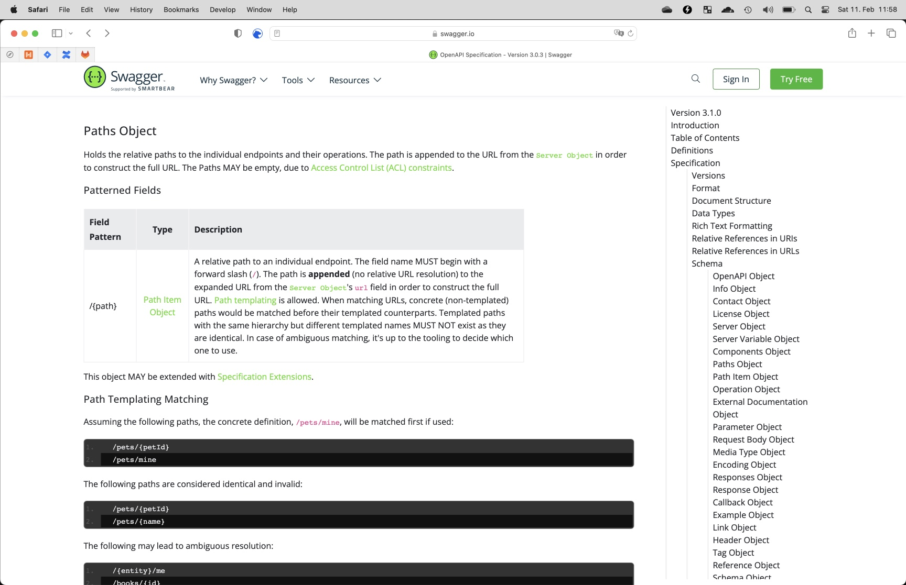

^ RTFM
Checkout https://www.openapis.org
Helps your write OpenAPI specifications

---

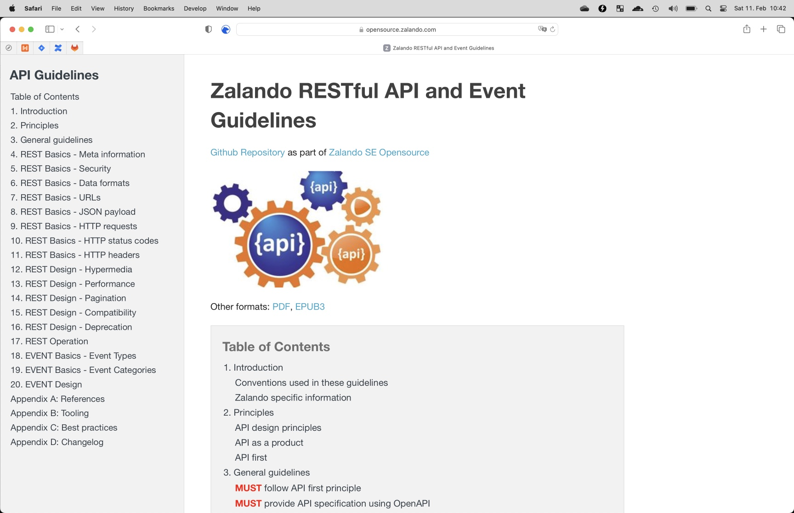

^  Helps your writing better REST APIs

---

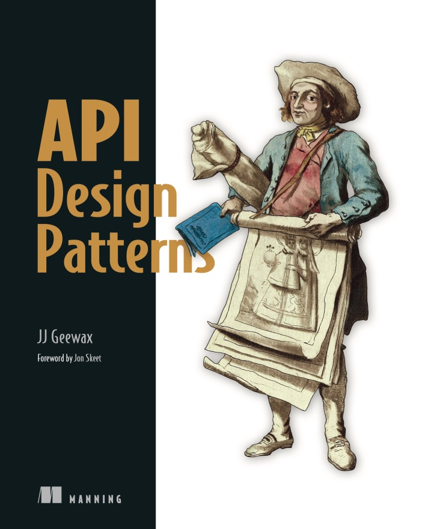

^ Helps your designing better REST APIs

---

## The All-Of Keyword

* How to model the data structures for POST/PUT/GET without duplication?
* The `allOf` keyword lets you combine and extend model definitions

---

### All-Of / Separate Resource Models

```yaml
components:
  schemas:
    SomeResourceCreationRequest:
      type: object
      properties:
        owner:
          type: string
        ...
    SomeResource:
      type: object
      allOf:
        - $ref: '#/components/schemas/SomeResourceCreationRequest'
      properties:
        id:
          type: string
          format: uuid
        createdAt:
          type: string
          format: date-time
      required:
        - id
        - createdAt
```

^ Create a new resource using a POST statement
Expected response is the newly created resource
Avoid duplication of creation request and resource

---

### All-Of / Modeling A Paginated Response

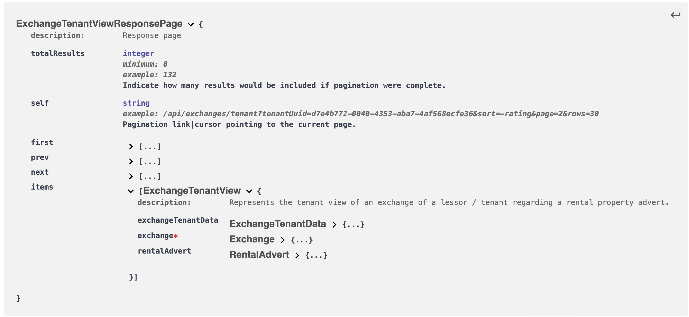

^ You have a bunch of response pages
Paging support adds a lot of boilerplate code

---

### All-Of / Modeling A Paginated Response

``` yaml
components:
  schemas:    
    ResponsePage:
      description: "Models a paginated search result."
      properties:
        totalResults:
          type: integer
          description: "Indicate how many results would be included if pagination were complete."
          minimum: 0
        self:
          description: "Pagination link|cursor pointing to the current page."
          type: string
        first:
          description: "Pagination link|cursor pointing to the first page."
          type: string
        prev:
          description: "Pagination link|cursor pointing to the previous page."
          type: string
        next:
          description: "Pagination link|cursor pointing to the next page."
          type: string

```

^ Define and re-use ResponsePage

---

### All-Of / Modeling A Paginated Response

``` yaml
components:
  schemas:    
    ExchangeTenantViewResponsePage:
      type: object
      description: Response page
      allOf:
        - $ref: '#/components/schemas/ResponsePage'
      properties:
        items:
          type: array
          items:
            $ref: '#/components/schemas/ExchangeTenantView'
```

---

## Configure JWT Authentication 

^ You want to provide an interactive OpenAPI file 

---

## Configure JWT Authentication 

* Enable bearer authentication
* Support non-authenticated endpoints

---

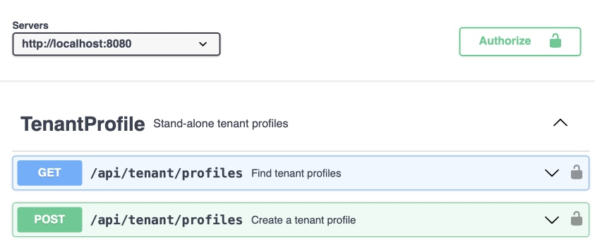

---

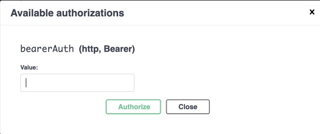

---

```yaml
security:
  - bearerAuth: [ ] # secure all endpoints (default)

components:
  securitySchemes:
    bearerAuth:
      type: http
      scheme: bearer
      bearerFormat: JWT
```

---

```yaml    
paths:
  /api/exchanges/tenant-profile:
    get:
      tags:
        - Exchange
      summary: Public view of the tenant profile secured by a token
      operationId: getPublicExchangeTenantProfile
      security: [ ]  # Disable security - public method
```

---


--- 

<!--

## Markdown In YAML

* Description fields support Markdown
  * Folded & literal text blocks
  * Tables
  * Links

---

-->

## OpenAPI Integrations

* Configuration of your Web Application Firewall (WAF)
  * WAF OpenAPI support by NGINX, F5
* Configuration of Amazon API Gateway 
* Swagger Parsers for custom integrations
* Bootstrap Bruno collection from OpenAPI import
* IntelliJ HTTP Clients can use OpenAPI to create requests

^ Advanced OpenAPI features might not be supported.

--- 


---

## Bruno Importing Of OpenAPI Specs

* Helpful for bootstrapping a brand-new Bruno collection
* Honors the *OpenAPI Tags* and *OpenAPI Endpoint Summaries*
* Generated `POST` request only have body with empty parameters 
* Environments are created based on *OpenAPI Servers Section*

---

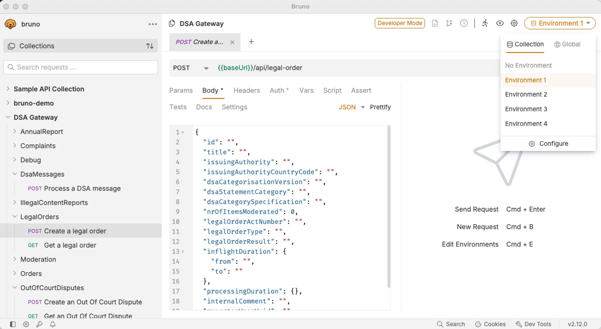

---

# Conclusion

* Open API is a widely used technology
  * Provides a lot of integration points
* Design-first approach is highly recommended
  * Leads to better REST APIs
* Code generation to sync between spec and code
  * You can generate client **and** server code

---

# And last bot not least

---


---


---

# Resources

* [https://www.openapis.org](https://www.openapis.org)
* [https://editor.swagger.io](https://editor.swagger.io)
* [https://github.com/OpenAPITools/openapi-generator](https://github.com/OpenAPITools/openapi-generator)
* [https://openapi-generator.tech/docs/generators/spring/](https://openapi-generator.tech/docs/generators/spring/)
* [https://opensource.zalando.com/restful-api-guidelines/](https://opensource.zalando.com/restful-api-guidelines/)
* [https://www.manning.com/books/api-design-patterns](https://www.manning.com/books/api-design-patterns)

---

# Resources

* [What’s New in OpenAPI 3.1](https://lornajane.net/posts/2020/whats-new-in-openapi-3-1)
* [https://www.postman.com/state-of-api](https://www.postman.com/state-of-api)
* [https://github.com/sgoeschl/presentations/tree/master/javameetup/openapi](https://github.com/sgoeschl/presentations/tree/master/javameetup/openapi)
* [Swagger Parser](https://github.com/swagger-api/swagger-parser)
* [Develop REST APIs using OpenAPI in API Gateway](https://docs.aws.amazon.com/apigateway/latest/developerguide/api-gateway-import-api.html)
* [Security concerns about the ongoing use of Postman](https://www.reddit.com/r/webdev/comments/1643zm8/security_concerns_about_the_ongoing_use_of_postman/)
