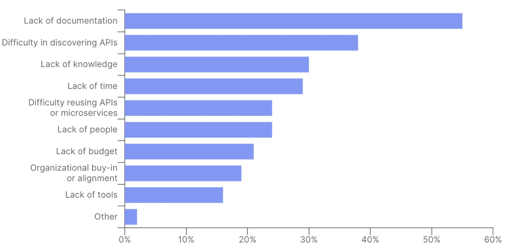
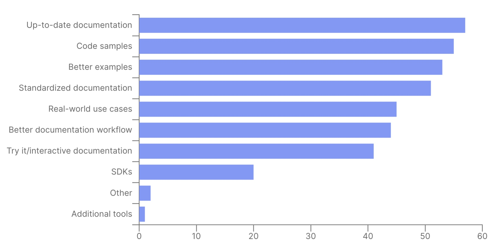
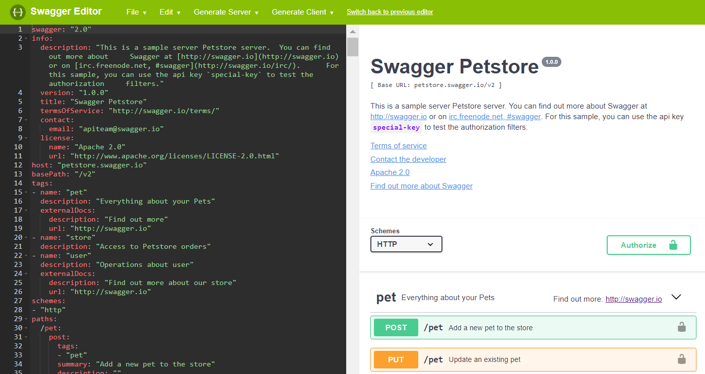
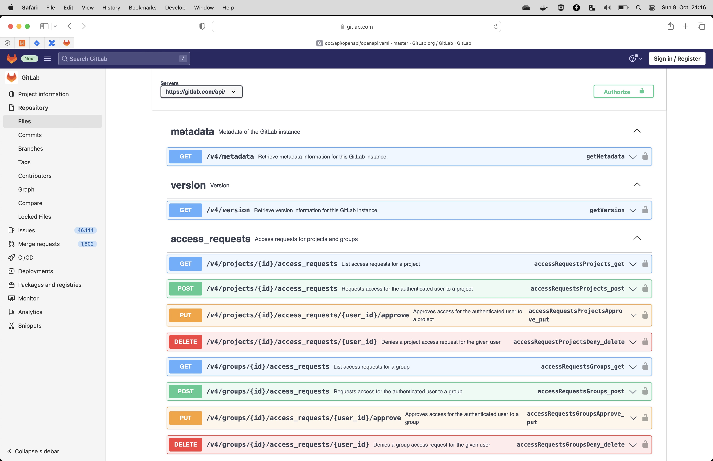

--- 


---

# What Is It?

> The OpenAPI Specification, previously known as the Swagger Specification, is a specification for machine-readable interface files for describing, producing, consuming, and visualizing RESTful web services
-- Wikipedia

---

# The Tool Formerly Known As Swagger

* Swagger development began in early 2010 by Tony Tam
* SmartBear purchased the Swagger API development in 2015
* In January 2016, renamed to OpenAPI
* In 2017, the OpenAPI Initiative released version 3.0.0
* In 2021, the OpenAPI Initiative released version 3.1.0

---

# Why Bother With OpenAPI?

---

# Obstacles To Consuming APIs[^1]



[^1]: Postman 2022 State Of The API Report

---

# Improving API Documentation[^1]



[^1]: Postman 2022 State Of The API Report

---


---

# OpenAPI Overview

---


--- 
# Info

```yaml
info:
  version: 1.0.0
  title: Swagger Petstore
  license:
    name: MIT
```

--- 

# Servers

```yaml
servers:
  - url: http://petstore.swagger.io/v1
```

---

# Security

```yaml
  securitySchemes:
    petstore_auth:
      type: oauth2
      flows:
        implicit:
          authorizationUrl: 'https://petstore3.swagger.io/oauth/authorize'
          scopes:
            'write:pets': modify pets in your account
            'read:pets': read your pets
```

--- 

# Paths

```yaml
paths:
  /pets:
    post:
      summary: Create a pet
      operationId: createPets
      tags:
        - pets
      responses:
        '201':
          description: Null response
        default:
          description: unexpected error
          content:
            application/json:
              schema:
                $ref: "#/components/schemas/Error"    
```

--- 

# Tags

```yaml
tags:
  - name: pet
    description: Everything about your Pets
    externalDocs:
      description: Find out more
      url: 'http://swagger.io'
  - name: store
    description: Access to Petstore orders
  - name: user
    description: Operations about user
```

---

# Components

```yaml
Error:
  type: object
  required:
    - code
    - message
  properties:
    code:
      type: integer
      format: int32
    message:
      type: string
```

---

# Swagger Editor [^2]



[^2]: Does not support OpenAPI 3.1.0 (yet)

---


---

# Design Or Code First?!

---

# Design First - The Good

* Early review of REST API
* Generate ugly source code
  * More annotations than code
* Better documentation quality than code first
  * Quicker to re-iterate
* Gitlab renders OpenAPI files nicely

---

# Gitlab Meets OpenAPI



---

# Design First - The Bad

* Learning curve for developers
  * Having good template helps
* Code & design might be out of sync
  * Code generation solves this problem

---

# openapi-generator-maven-plugin

---

```xml
<configuration>
    <inputSpec>
        ${project.basedir}/src/main/resources/rentalapi-openapi-3.yml
    </inputSpec>
    <generatorName>spring</generatorName>
    <apiPackage>at.willhaben.rental.tenant.rest.api</apiPackage>
    <modelPackage>at.willhaben.rental.tenant.rest.model</modelPackage>
    <supportingFilesToGenerate>
        ApiUtil.java
    </supportingFilesToGenerate>
    <configOptions>
        <delegatePattern>true</delegatePattern>
        <openApiNullable>false</openApiNullable>
        <useTags>true</useTags>
        <hideGenerationTimestamp>true</hideGenerationTimestamp>
    </configOptions>
</configuration>
```

---

# openapi-generator-maven-plugin

* `delegatePattern` separates generated & written code
* Skipping `openApiNullable` and additional Jackson library
* `useTags` is nice since it generates an interface per tag
* `hideGenerationTimestamp` to keep you and Git happy

---

# Generated APIs

```
src/main/java/com/github/sgoeschl/openapi/demo/api
|-- ApiUtil.java
|-- PetApi.java
|-- PetApiController.java
|-- PetApiDelegate.java
|-- StoreApi.java
|-- StoreApiController.java
|-- StoreApiDelegate.java
|-- UserApi.java
|-- UserApiController.java
`-- UserApiDelegate.java
```

---

# Generated Model Classes

```
src/main/java/com/github/sgoeschl/openapi/demo/model
|-- Address.java
|-- Category.java
|-- Customer.java
|-- ModelApiResponse.java
|-- Order.java
|-- Pet.java
|-- Tag.java
```

---

# Controller Using Delegate

```java
@Generated(value = "org.openapitools.codegen.languages.SpringCodegen")
@Controller
@RequestMapping("${openapi.swaggerPetstoreOpenAPI30.base-path:/api/v3}")
public class PetApiController implements PetApi {

    private final PetApiDelegate delegate;

    public PetApiController(
        @Autowired(required = false) PetApiDelegate delegate) {
        this.delegate = ofNullable(delegate).orElse(new PetApiDelegate() {});
    }

    @Override
    public PetApiDelegate getDelegate() {
        return delegate;
    }
}
```

---

# Bean Validation In Action

```java
  @Min(0) @Max(99) 
  @Schema(
    name = "nrOfPersons", 
    example = "2", 
    description = "Number of persons to live in the rental property", 
    required = false)
  public Integer getNrOfPersons() {
    return nrOfPersons;
  }
```

---

# openapi-generator-maven-plugin

* We are generating `Typescript` and `Java` code
  * Java code is used 1:1 by BE devs
  * Typescript as inspiration for FE devs
* Review the generated source code
  * Generators are from varying quality

--- 

# Bonus Points

* Swagger Editor
  * Perfect for rapid prototyping
  * Best tool for verifying OpenAPI files
* OpenAPI files can be directly imported into Postman
  * Starting point for our Postman collections
  * Postman collection maintained by BE devs

--- 

# Bonus Points

* Bean validation works nicely
  * Validate all of your input parameters
* Put OpenAPI files under version control
  * No more "do you have the latest version"
  * You can do Merge/Pull Requests

--- 

# Conclusion

* Design-first API with OpenAPI saves time
* Use code generation to sync between spec and code
* Developers love documenation and examples
* Use generated Postman collection as starting point