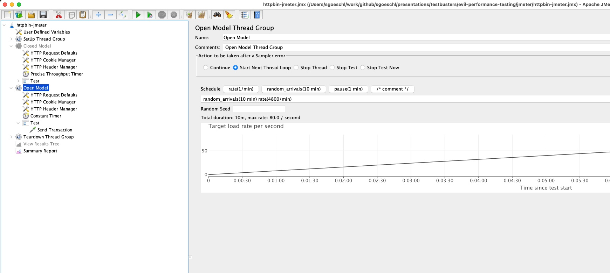

# JMeter Tests 

## Overview

The JMeter test contains of two different `Thread Groups` (only one of them should be enabled)

* `Closed Model` using a `Precise Throughput Timer`
* `Open Model` using an `Open Model Thread Group` 



## Command Line Invocation

```bash
# Start the JMeter GUI
> jmeter -t httpbin-jmeter.jmx

# Run a JMeter test scenario
> runme.sh 
```

## Spring Boot HTTPBin Server

* A modified version of [dyrnq / springboot-httpbin](https://github.com/dyrnq/springboot-httpbin) is used to simulate a "Stop The World GC Pause
* My actual source code is found here: https://github.com/sgoeschl/springboot-httpbin 
* After starting you can look at the OpenAPI stuff using [http://localhost:8080](http://localhost:8080)

