theme: Merriweather,8
# Postman Is Dead
## Long Live Bruno
#### Siegfried GOESCHL
#### ASCIIFISH

---

--- 

## About Siegfried

[.column]
* Writing Java backend code
* Infamous for motivation skills & management presentations
* Likes performance testing & engineering
* Helps at the Java Meetup Vienna & DevFest Vienna

[.column]

---

## Postman Is Dead

| Year | Milestone                                                                                                           |
|------|---------------------------------------------------------------------------------------------------------------------|
| 2012 | Abhinav Asthan wrote Postman as Chrome extension                                                                    |
| 2013 | Postman company was officially founded in Bangalore                                                                 |
| 2017 | Corporate headquarters moved from Bangalore to San Francisco                                                        |
| 2021 | Raised a $225 million at a $5.6 billion valuation                                                                   |
| 2023 | Postman allows only 25 manual collection runs per month with Free and Basic plans                                   |
| 2023 | Postman has discontinued option to have Collections locally and forcing people to move all the data into your cloud |
| 2024 | Public Postman collections considered as security risk                                                              |

--- 

## Long Live Bruno

| Year | Milestone                                                                                                           |
|------|---------------------------------------------------------------------------------------------------------------------|
| 2021 | Anoop M.D. started Bruno as side project in Bangalore                                                               |
| 2022 | Bruno was open-sourced on GitHub under the MIT license                                                              |
| 2024 | The Bruno company was founded in Bangalore                                                                          |
| 2024 | Bruno appears on Thoughtwork's Technology Radar.                                                                    |

--- 

## Rinse And Repeat

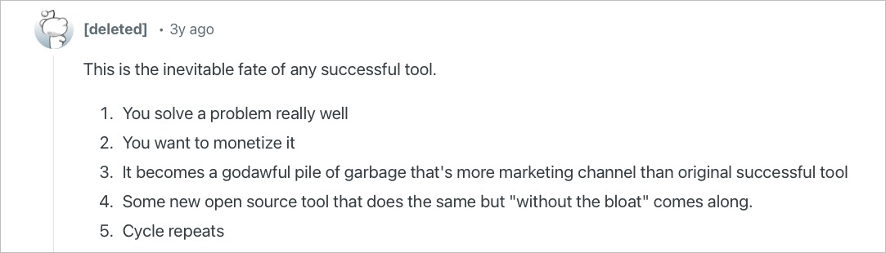

^ See https://www.reddit.com/r/ProgrammerHumor/comments/xpvq7e/overengineering/

--- 

## Main Reasons To Use Bruno

* Free version is suitable for real-world testing
* Local-first approach, no cloud login / lock-in
* File-based storage is easily integrated with Git
* CLI Support for CI/CD using **bru**
* Secrets handling available in free version
* Supports HTTP, gRPC & GraphQL

---

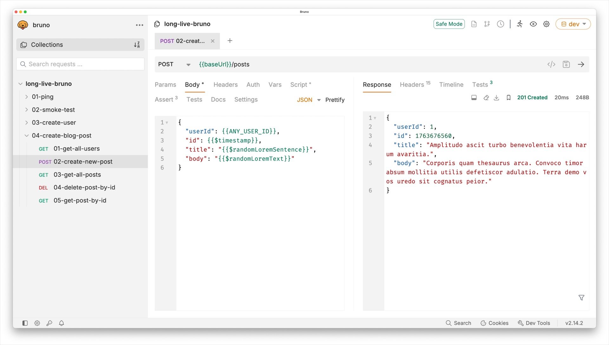

---

## Git-Friendly Directory Layout

[.column]

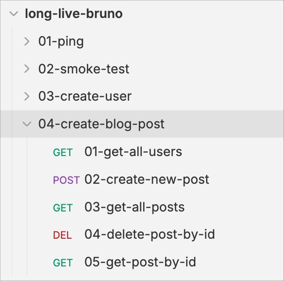

[.column]

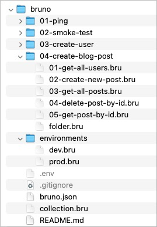

^ Bruno collections are mapped 1:1 to the file system

---

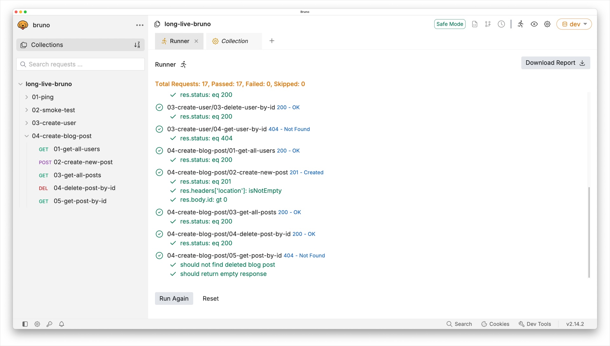

^ It is a good idea to execute your Bruno tests in your CI/CD pipeline

---

# Some Essential Bruno Features

---

## Generate Code From HTTP Request

* Supports multiple CLI tools, e.g. curl or httpie
* Useful if your want to add a curl request to JIRA ticket
* Supports code snippets for various programming languages
  * If you ever want to see OCaml code, this is your chance

---

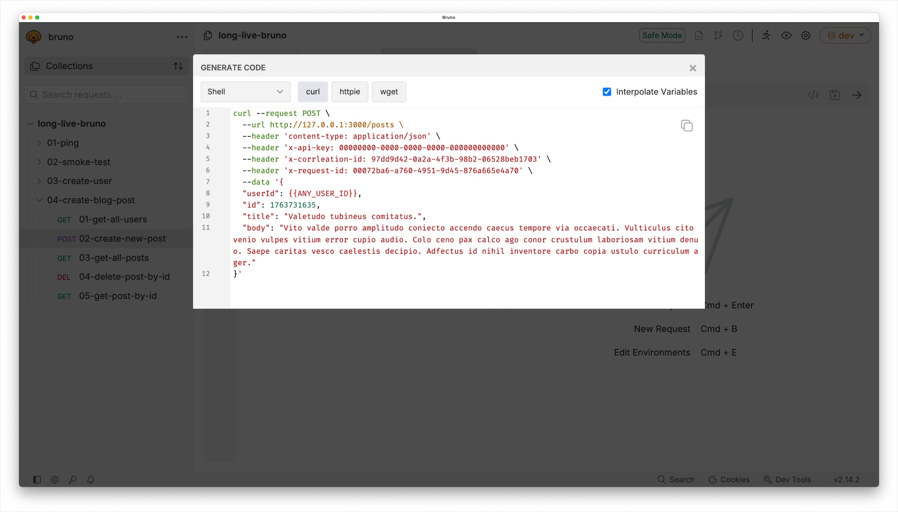

---

## Bruno Scripting

* Bruno supports Javascript execution to enrich collections
* Allows to execute actions before and after each test
  * Collection scripts
  * Folder scripts
  * Request scripts

---

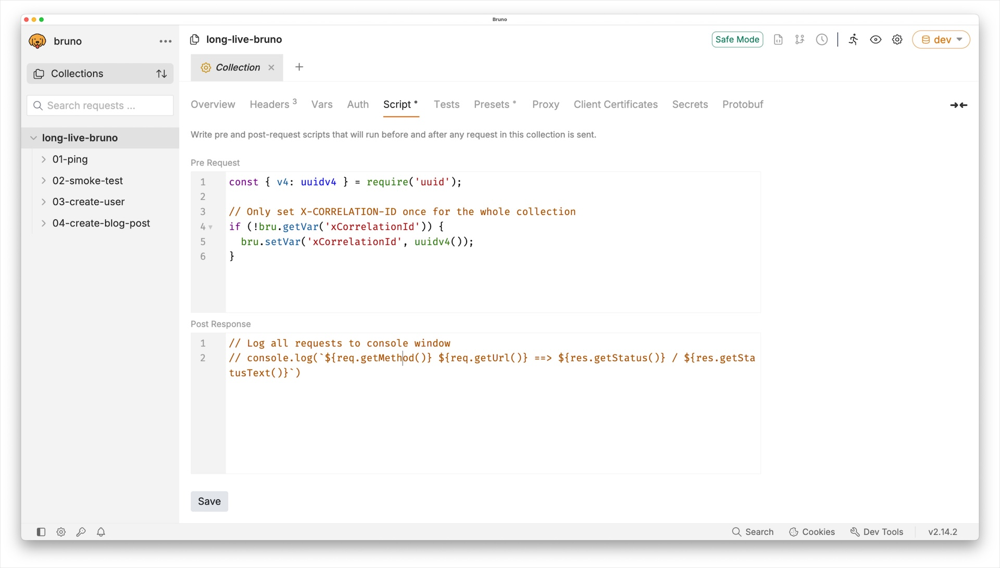

---

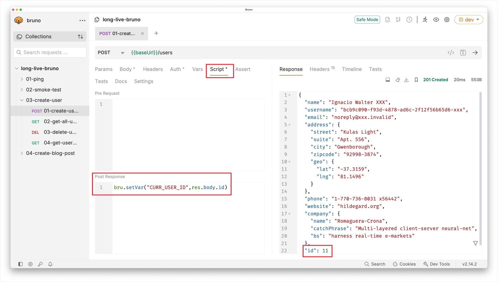

---

---

## Secret Management

* Plain-text secrets stored in test scripts are a major pain point
* Things are even worse when plain-text secrets are found in Git
* You, security scanners, SonarQube and your CISO will be unhappy
* Bruno's free version supports two options
  * Secret Variables - encrypted & stored locally
  * DotEnv File - local & excluded from version control

---

## Secret Management

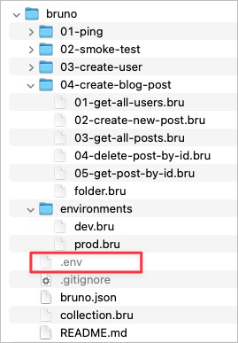

---

## Secret Management

* The **.env** file contains secrets as key/value pairs
* The **.env** file is exclude from Git by **.gitignore** 
* Your local secrets file **is not** under version control
* The secrets are used in Bruno's environment configuration
* Switching environment picks up the matching secret

---

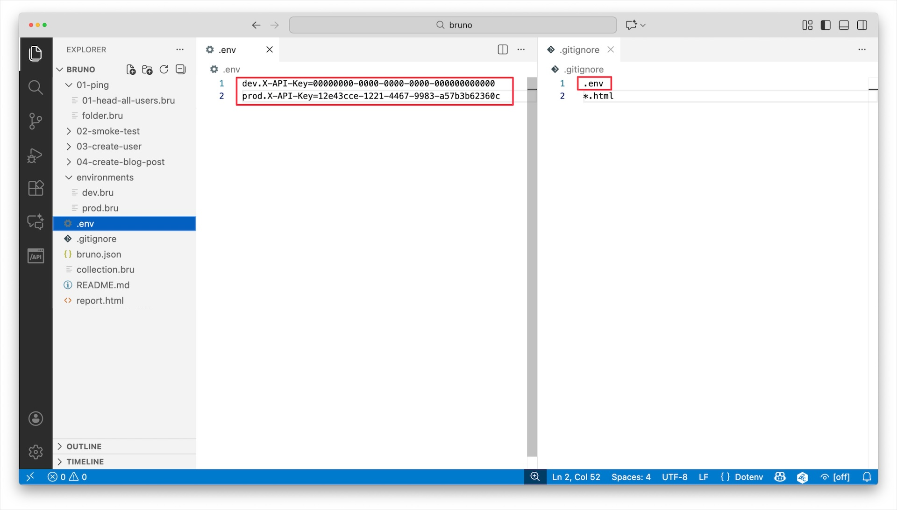

---

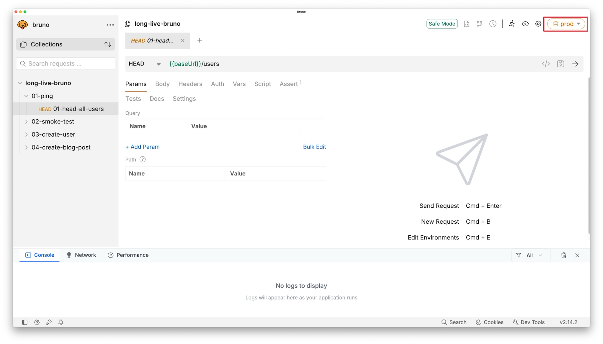

---

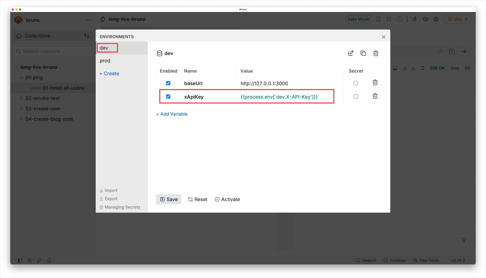

---

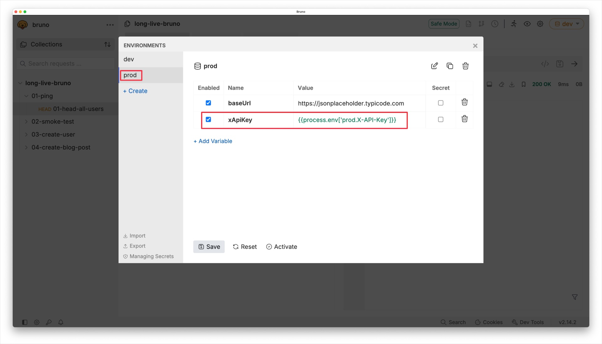

---

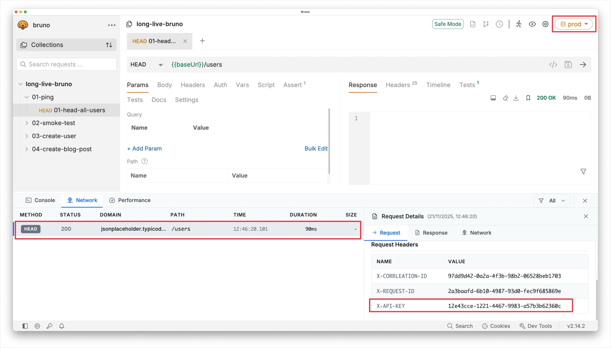

---

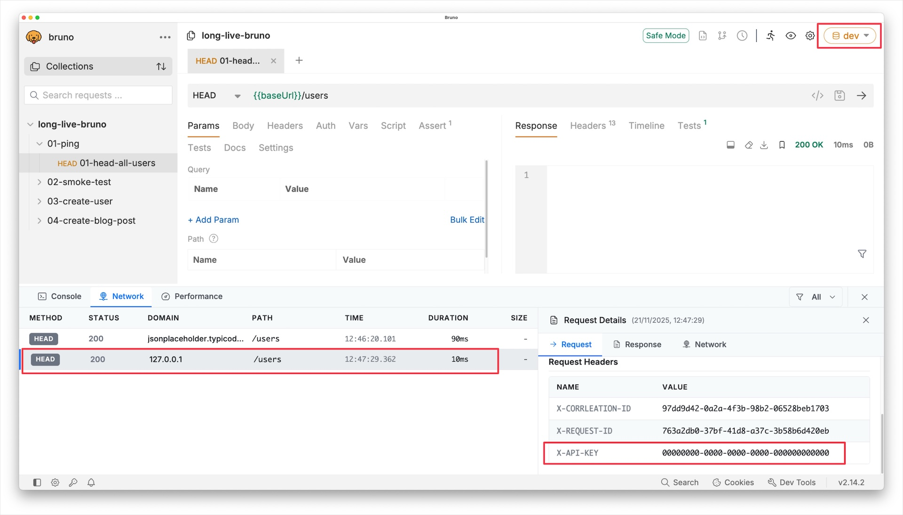

---

---

## Regression Testing

* You just finished your new & shiny Bruno collection
* Manual testing is soo old-school - even I don't do it
* Run your collections in GitHub or Jenkins
* Under the hood the **bru** CLI tool is used
* See [Bruno CLI](https://docs.usebruno.com/bru-cli/overview) for more information

---

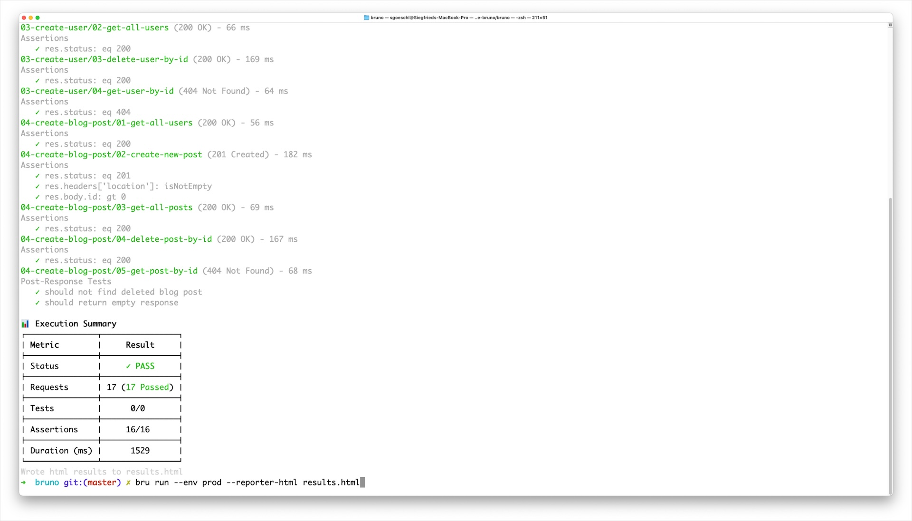

---

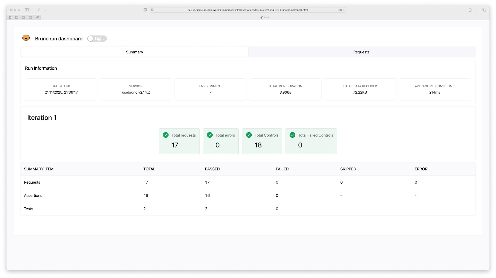

---

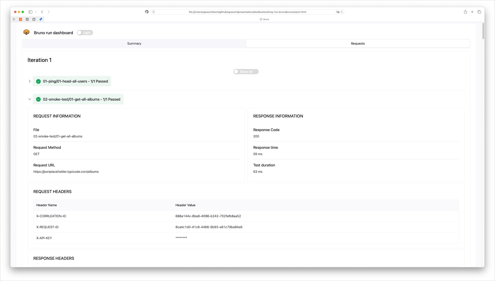

---

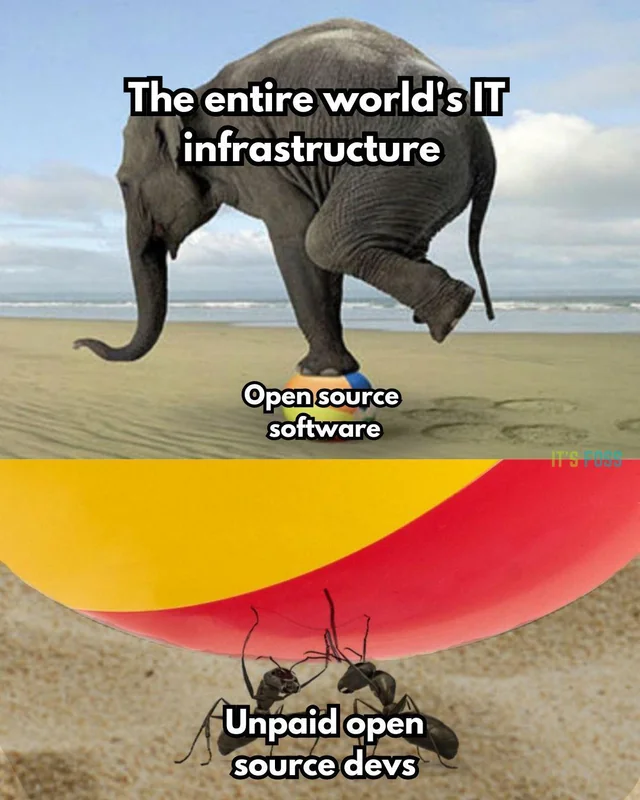

--- 

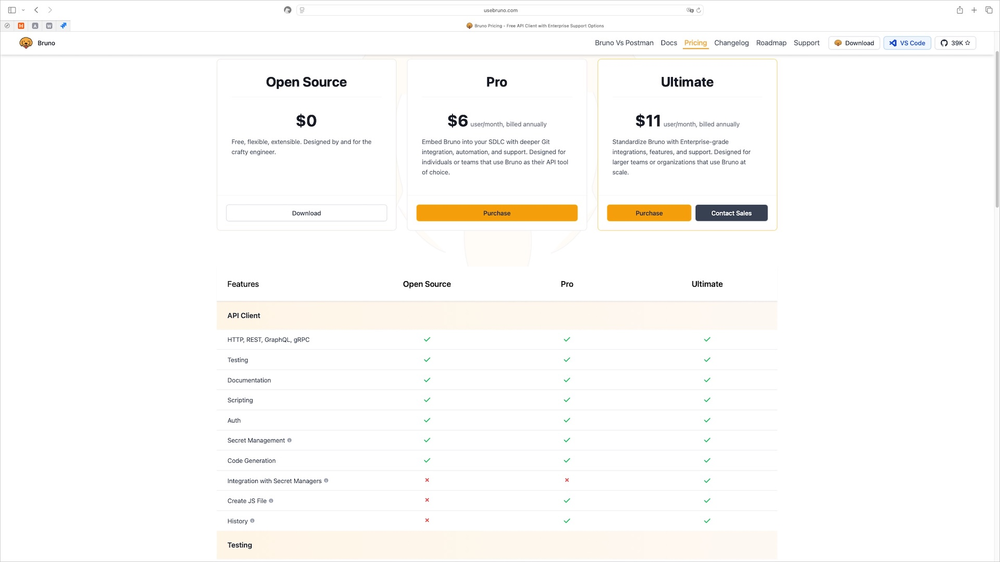

---

## Summary

* Bruno is the new kid on the block replacing Postman
* The "Free / Open Source" tier is suitable for real-world testing
* But you may / should shell out some bucks - for the good karma ;-)
* Checkout the official [Postman Migration documentation](https://docs.usebruno.com/get-started/import-export-data/postman-migration)

---

---

## References

* [Postman @ Wikipedia](https://en.wikipedia.org/wiki/Postman_(software))
* [Postman Data Leaks: The Hidden Risks Lurking in Your Workspaces](https://www.cloudsek.com/blog/postman-data-leaks-the-hidden-risks-lurking-in-your-workspaces)
* [API Testing Tools: Postman vs. Bruno API Client](https://www.qytera.de/blog/api-testing-tools-postman-vs-bruno)
* [The reason I stopped using Postman for API Pentests](https://www.secureideas.com/blog/the-reason-i-stopped-using-postman-for-api-pentests)
* [Security concerns about the ongoing use of Postman](https://www.reddit.com/r/webdev/comments/1643zm8/security_concerns_about_the_ongoing_use_of_postman/)

---

## References

* [Bruno - Opensource, Sustainability, Privacy, Freedom and Incentive](https://github.com/usebruno/bruno/discussions/269)
* [Bruno with GitHub Actions](https://medium.com/@mustafabawany204/bruno-with-github-actions-eab7300af362)
* [Postman Migration documentation](https://docs.usebruno.com/get-started/import-export-data/postman-migration)
* [Technology Radar](https://www.thoughtworks.com/radar/tools/bruno)
* [6 Game-Changing Postman Alternatives That Will Revolutionize Your API Development in 2025](https://dev.to/rihpig/6-game-changing-postman-alternatives-that-will-revolutionize-your-api-development-in-2025-4fll?utm_source=chatgpt.com)