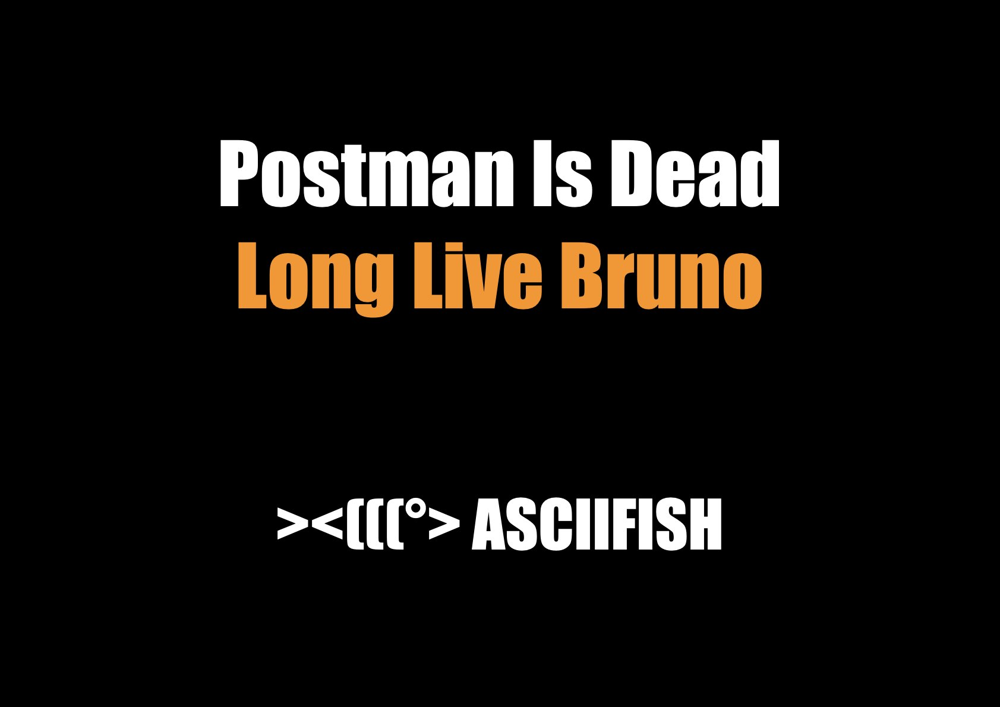
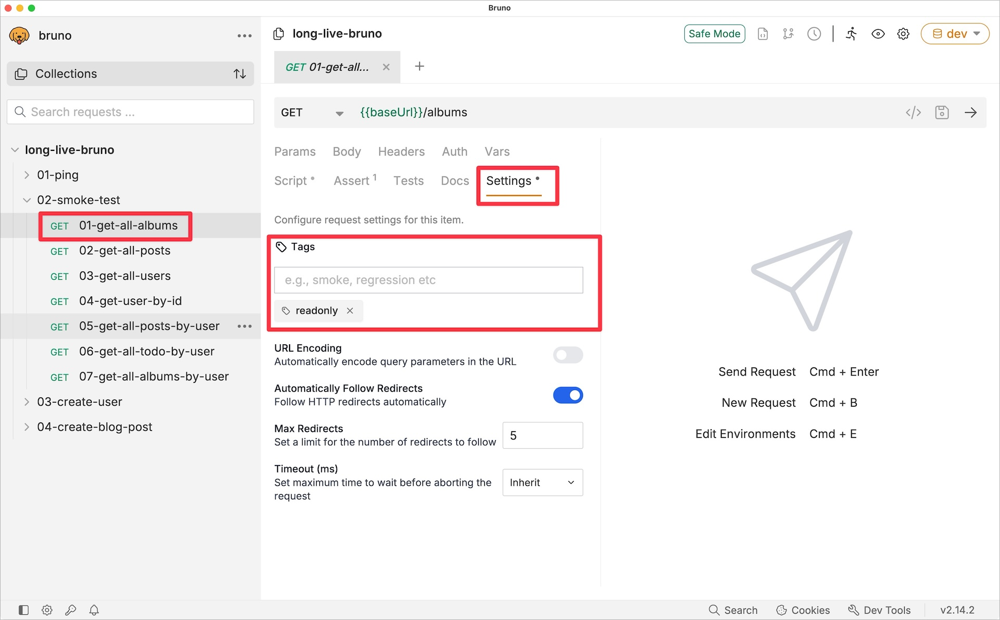
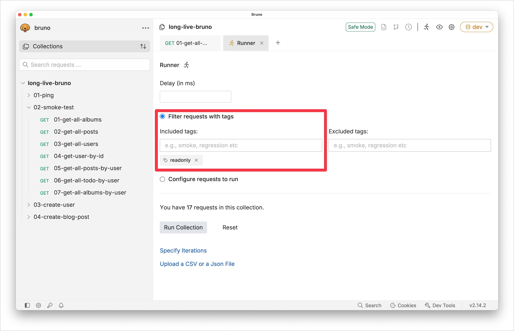
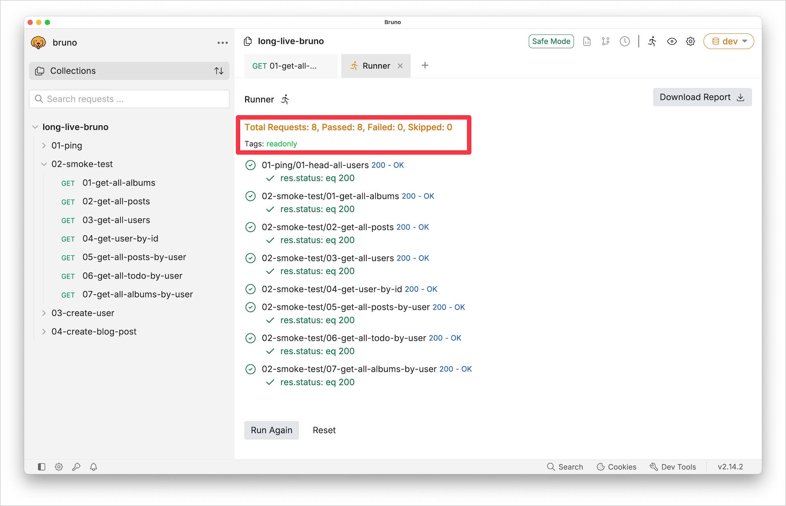
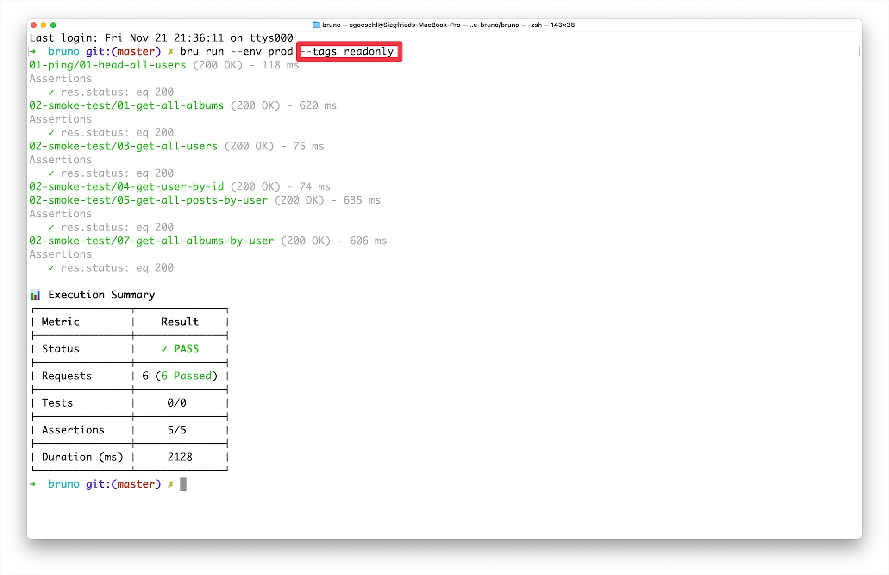

theme: Merriweather,8

--- 

## About Siegfried

[.column]
* Writing Java backend code
* Infamous for motivational skills and management presentations
* Likes performance testing and engineering
* Helps at the Java Meetup Vienna & DevFest Vienna

[.column]

---

## Managing Expectations

---

---

--- 

## Overview

* Have a look at Postman's and Bruno's histories
* Short introduction to Bruno and its main features
* Secret handling in Bruno's free edition
* Run Bruno collections in your CI/CD pipeline

---

## Postman Is Dead

| Year | Milestone                                                                                                           |
|------|---------------------------------------------------------------------------------------------------------------------|
| 2012 | Abhinav Asthan wrote Postman as Chrome extension                                                                    |
| 2013 | Postman company was officially founded in Bangalore                                                                 |
| 2017 | Corporate headquarters moved from Bangalore to San Francisco                                                        |
| 2021 | Raised a $225 million at a $5.6 billion valuation                                                                   |
| 2023 | Postman allows only 25 manual collection runs per month with Free and Basic plans                                   |
| 2023 | Postman has discontinued option to have Collections locally and forcing people to move all the data into your cloud |
| 2024 | Public Postman collections considered as security risk                                                              |

--- 

## Long Live Bruno

| Year | Milestone                                                                                                           |
|------|---------------------------------------------------------------------------------------------------------------------|
| 2021 | Anoop M.D. started Bruno as side project in Bangalore                                                               |
| 2022 | Bruno was open-sourced on GitHub under the MIT license                                                              |
| 2024 | The Bruno company was founded in Bangalore                                                                          |
| 2024 | Bruno appears on Thoughtwork's Technology Radar.                                                                    |

--- 

## Rinse And Repeat

^ See https://www.reddit.com/r/ProgrammerHumor/comments/xpvq7e/overengineering/

--- 

## Reasons To Use Bruno

* Free version is suitable for real-world testing
* Local-first approach, no cloud login / lock-in
* File-based storage integrates seamlessly with Git
* CLI Support for CI/CD using **bru**
* Secrets handling is available in the free version
* Supports HTTP, gRPC & GraphQL

---

---

## Git-Friendly Directory Layout

[.column]

[.column]

^ Bruno collections are mapped 1:1 to the file system

---

^ Integrated Collection Runner gives some textual feedback

---

# Some Essential Bruno Features

---

## Generate Code From HTTP Request

* Supports multiple CLI tools, e.g. curl or httpie
* Useful if you want to add a curl request to a JIRA ticket.
* Supports code snippets for various programming languages

^ If you ever want to see OCaml code, this is your chance

---

---

## Bruno Scripting

* Bruno supports Javascript execution to help with testing
* Allows executing actions before and after each test
  * Collection scripts
  * Folder scripts
  * Request scripts
* Default ordering is **Sandwich Flow** - upside down and back

---

---

---

---

## Secret Management

* Plain-text secrets stored in test scripts are a major pain point
* Things are even worse for  plain-text secrets in Git
* You, security scanners, SonarQube and your CISO will be unhappy
* Bruno's free version supports two options
  * Secret Variables - encrypted & stored locally
  * DotEnv File - local & excluded from version control

---

## Secret Management

---

## Secret Management

* The **.env** file contains secrets as key/value pairs
* The **.env** file is excluded from Git by .gitignore 
* Your local secrets file **is not** under version control
* The secrets are used in Bruno's environment configuration
* Switching the environment picks up the matching secret

---

^ .env contains two different API keys

---

^ Selecting the environments via Dropdown

---

^ Wiring the "dev" API Key

---

^ Wiring the "prod" API Key 

---

^ Selecting the "prod" environment sends the "prod" X-API-KEY

---

^ Selecting the "dev" environment sends the "dev" X-API-KEY

---

---

## Automated Testing

* You finished your new & shiny Bruno collection
* Manual testing is old-school - even I don't do it
* Run your collections in GitHub or Jenkins
  * Under the hood the **bru** CLI tool is used
  * See [Bruno CLI](https://docs.usebruno.com/bru-cli/overview) for more information

---

^ Run a Bruno Collection on the command line and create HTML report 

---

^ Lovely visual report perfect for management

---

^ You can drill into the request details

---

## Bruno Tags

* Not all test environments are created equal
  * DEV environment run all tests
  * PROD smoke tests should be read-only
* You can assign one or more tags to a request, e.g. *readonly*
* Test runner execution supports including / excluding tags

---

^ Tags are created on individual request level (folder level would be cool)

---

^ Select the tags to be executed on the Collection Runner

---

^ Runs 8 instead of 17 tests

---

^ You can define the tags also on the Bruno CLI (test automation) 

---

--- 

---

## Bruno Musings

* OAuth2 integration is well done and supports troubleshooting
* Bruno supports import of OpenAOI files, works but is rather basic
* Documentation of Bruno collections uses Markdown
* Bruno provides some "Dev Tools" to support request debugging
* PDFs are directly rendered in Bruno response pag

---

## Any Other Options Out There?

  ---

| Tool | License & Cost | Primary UX | Storage Model | Collaboration | CLI/CI | Scripting/Tests | Protocols | OpenAPI/Collections | Secrets Handling |
|---|---|---|---|---|---|---|---|---|---|
| Postman | Freemium (cloud); enterprise plans | Desktop/Web app | Cloud workspaces (JSON export) | Strong team/collab, comments, roles | Newman (OSS) + Postman CLI | Pre‑request/Tests (JS), rich libs | HTTP, GraphQL, WebSocket (beta/varies) | First‑class OpenAPI & Postman Collections | Env/secret variables; managed secrets in cloud |
| Bruno | Open source (MIT); free | Desktop app + CLI | Filesystem‑first (`.bru` text files) | Git‑native sharing via repo | `bru` (first‑class CLI) | Pre/Post scripts (JS), assertions | HTTP, GraphQL (focus); WS support varies | Imports Postman/OpenAPI/cURL | Encrypted vault; env files in Git |
| Insomnia | Core OSS + paid cloud (Kong) | Desktop app | Local JSON/YAML; Git sync via Git or cloud | Team sharing via cloud or Git | `inso` CLI (design/test/run) | JS templating, test suites | HTTP, GraphQL, gRPC | Strong OpenAPI (Kong), Postman import | Encrypted vault, envs, Git ignore |
| IntelliJ HTTP Client | Included in IntelliJ (CE/Ultimate) | In‑IDE text (`.http`) | Plain text in repo | Code review via Git | IntelliJ HTTP Client CLI/Docker | Inline JS tests via `client.test` | HTTP, GraphQL, WebSocket, SSE | OpenAPI‑aware in IDE | `http-client.private.env.*` ignored by VCS |
| Hoppscotch | OSS + cloud | Web app (PWA) | Cloud/local export | Shareable links/workspaces | Hoppscotch CLI (community) | Basic test scripting | HTTP, GraphQL, WebSocket | OpenAPI import/export | Cloud secrets; local envs |
| VS Code REST Client | Free (extension) | In‑editor text (`.http`) | Plain text in repo | Git PRs/code review | Via `rest-cli`/community scripts | Basic tests via `test` syntax | HTTP, GraphQL | cURL/OpenAPI import (extensions) | Env variables + OS keychain (varies) |

---

## IntelliJ HTTP Client Versus Bruno

* IntelliJ HTTP client is not part of IntelliJ Community Edition
  * Makes hard to use for non-developers
  * There is **JetBrains HTTP Client CLI** 
* IntelliJ HTTP Client is text based while Bruno uses GUI
  * Developers can of course write **bru** files :-)

---

## Summary

* Bruno is the new kid on the block replacing [Postman]((https://docs.usebruno.com/get-started/import-export-data/postman-migration)
* The "Free / Open Source" tier is suitable for real-world testing
  * But you may / should shell out some bucks
* Bruno is rapidly adding features (see [Roadmap](https://www.usebruno.com/roadmap))
* You might work with Bruno in the next few years :-)
* Be prepared to move to another tool in 10 years

---

---

## References

* [Postman @ Wikipedia](https://en.wikipedia.org/wiki/Postman_(software))
* [Postman Data Leaks: The Hidden Risks Lurking in Your Workspaces](https://www.cloudsek.com/blog/postman-data-leaks-the-hidden-risks-lurking-in-your-workspaces)
* [API Testing Tools: Postman vs. Bruno API Client](https://www.qytera.de/blog/api-testing-tools-postman-vs-bruno)
* [The reason I stopped using Postman for API Pentests](https://www.secureideas.com/blog/the-reason-i-stopped-using-postman-for-api-pentests)
* [Security concerns about the ongoing use of Postman](https://www.reddit.com/r/webdev/comments/1643zm8/security_concerns_about_the_ongoing_use_of_postman/)

---

## References

* [Bruno - Opensource, Sustainability, Privacy, Freedom and Incentive](https://github.com/usebruno/bruno/discussions/269)
* [Bruno with GitHub Actions](https://medium.com/@mustafabawany204/bruno-with-github-actions-eab7300af362)
* [Postman Migration documentation](https://docs.usebruno.com/get-started/import-export-data/postman-migration)
* [Thoughtworks Technology Radar](https://www.thoughtworks.com/radar/tools/bruno)
* [6 Game-Changing Postman Alternatives](https://dev.to/rihpig/6-game-changing-postman-alternatives-that-will-revolutionize-your-api-development-in-2025-4fll?utm_source=chatgpt.com)
